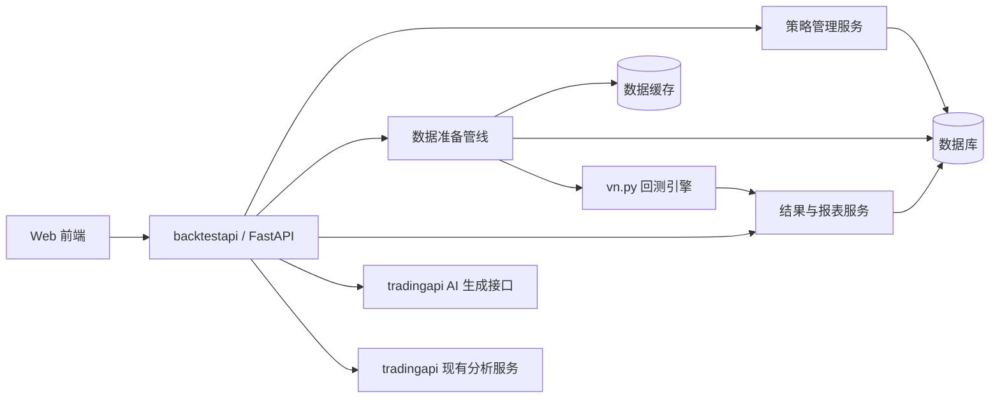

# backtestapi 设计草案


cd /Users/leven/space/hein/gusheng/backtestapi
source .venv/bin/activate
python3 -m pip install -e .
python3 -m uvicorn api.main:app --host 0.0.0.0 --port 8001 --reload

## 目标

`backtestapi` 作为独立的 A 股策略回测服务，和现有 `tradingapi` 并行部署。

定位如下：

- `tradingapi` 继续负责 AI 分析、研报、任务流、自选股等
- `backtestapi` 专注于策略管理、A 股回测、历史结果、参数配置、结果展示
- 回测引擎优先采用 `vn.py`，把它作为执行底座，而不是从零写撮合和账本

## 第一阶段范围

先只做日频、单股票、单策略回测，确保主链路跑通：

- 股票选择
- 策略选择
- 参数配置
- 策略代码编辑和保存
- 策略代码校验
- AI 生成策略代码预留
- 回测任务提交
- 回测结果保存
- 回测历史查询
- 回测详情查看

第二阶段再扩展：

- 多标的组合回测
- 分钟级回测
- 参数优化
- Walk-forward
- 更完整的 A 股制度规则

## 总体架构



### 设计原则

1. 策略和撮合分离，策略只产生命令，`vn.py` 负责执行
2. 回测异步化，HTTP 请求只负责提交任务和查询状态
3. 数据标准化先行，行情、复权、交易日历、停牌、涨跌停要统一处理
4. 结果落库，回测历史必须可复现、可追踪
5. 先单标的日频跑通，再扩展复杂形态

## 目录结构建议

```text
backtestapi/
├── api/
│   ├── main.py                 # FastAPI 入口
│   ├── database.py             # 数据库连接、Base、Session
│   ├── settings.py             # 配置加载
│   ├── schemas/                # Pydantic 请求响应模型
│   ├── routers/                # HTTP 路由层
│   └── services/               # 业务服务
├── core/
│   ├── engine/                 # vn.py 回测封装
│   ├── strategy/               # 策略管理、校验、动态加载
│   ├── data/                   # 数据拉取、清洗、复权、缓存
│   ├── risk/                   # A 股制度约束、仓位、风控
│   ├── metrics/                # 绩效指标计算
│   ├── report/                 # 回测报告生成
│   └── utils/                  # 通用工具
├── workers/
│   ├── backtest_worker.py      # 异步回测任务
│   └── strategy_worker.py      # 策略执行/验证任务
├── tests/
│   ├── test_strategies.py
│   ├── test_data_pipeline.py
│   ├── test_backtest_engine.py
│   └── test_api.py
├── requirements.txt
└── README.md
```

## 数据库表设计

建议使用 PostgreSQL 或 SQLite 起步，字段按业务可迁移设计。

### 1. `strategies`

保存用户策略代码和元信息。

字段建议：

- `id`
- `name`
- `code`
- `language`
- `description`
- `tags`
- `parameters_schema`
- `version`
- `is_template`
- `template_type`
- `created_at`
- `updated_at`
- `status`

用途：

- 策略 CRUD
- 代码版本管理
- AI 生成代码落库
- 回测引用策略版本

### 2. `backtest_jobs`

保存回测任务状态。

字段建议：

- `id`
- `job_id`
- `strategy_id`
- `strategy_version`
- `symbol`
- `start_date`
- `end_date`
- `initial_capital`
- `commission_rate`
- `slippage`
- `status`  `pending|running|completed|failed|cancelled`
- `progress`
- `error_message`
- `created_at`
- `started_at`
- `finished_at`

用途：

- 提交任务
- 查询进度
- 取消任务
- 历史追踪

### 3. `backtest_results`

保存回测汇总指标。

字段建议：

- `id`
- `job_id`
- `strategy_id`
- `strategy_name`
- `symbol`
- `start_date`
- `end_date`
- `initial_capital`
- `final_capital`
- `total_return`
- `annual_return`
- `benchmark_return`
- `max_drawdown`
- `volatility`
- `sharpe_ratio`
- `sortino_ratio`
- `calmar_ratio`
- `total_trades`
- `win_trades`
- `loss_trades`
- `win_rate`
- `profit_loss_ratio`
- `avg_profit`
- `avg_loss`
- `max_profit`
- `max_loss`
- `equity_curve_json`
- `metrics_json`
- `created_at`

用途：

- 历史列表
- 回测详情页
- 报表导出

### 4. `backtest_trades`

保存成交明细。

字段建议：

- `id`
- `job_id`
- `trade_id`
- `order_id`
- `symbol`
- `side`
- `price`
- `quantity`
- `commission`
- `trade_time`
- `bar_time`
- `pnl`

用途：

- 交易明细展示
- 单笔盈亏分析
- 回测审计

### 5. `backtest_equity_points`

保存资金曲线点。

字段建议：

- `id`
- `job_id`
- `trade_date`
- `equity`
- `cash`
- `position_value`
- `drawdown`

用途：

- 曲线展示
- 回撤分析
- 日频归档

### 6. `market_data_cache`

保存清洗后的行情缓存。

字段建议：

- `id`
- `symbol`
- `frequency`
- `trade_date`
- `open`
- `high`
- `low`
- `close`
- `volume`
- `amount`
- `adj_factor`
- `limit_up`
- `limit_down`
- `is_suspended`
- `source`
- `updated_at`

用途：

- 回测前数据预处理缓存
- 降低重复拉取成本

## API 草案

### 策略管理

#### `GET /api/v1/strategies`
返回策略列表。

Query：

- `skip`
- `limit`
- `keyword`
- `status`

#### `POST /api/v1/strategies`
创建策略。

请求体：

- `name`
- `code`
- `description`
- `parameters_schema`
- `is_template`

#### `GET /api/v1/strategies/{strategy_id}`
获取策略详情。

#### `PUT /api/v1/strategies/{strategy_id}`
更新策略代码或元信息。

#### `DELETE /api/v1/strategies/{strategy_id}`
删除策略。

#### `POST /api/v1/strategies/validate`
校验策略代码。

请求体：

- `code`

返回：

- `valid`
- `errors`
- `warnings`

#### `POST /api/v1/strategies/generate`
预留 AI 生成策略入口。

请求体：

- `prompt`
- `style`
- `symbol`
- `horizon`

返回：

- `code`
- `summary`
- `parameters_schema`

### 回测任务

#### `POST /api/v1/backtests/run`
提交回测任务。

请求体：

- `strategy_id`
- `symbol`
- `start_date`
- `end_date`
- `initial_capital`
- `commission_rate`
- `slippage`
- `parameters`
- `data_source`
- `benchmark_symbol`

返回：

- `job_id`
- `status`
- `message`

#### `GET /api/v1/backtests`
查询回测历史。

Query：

- `skip`
- `limit`
- `strategy_id`
- `symbol`
- `status`

#### `GET /api/v1/backtests/{job_id}`
获取回测任务详情和汇总结果。

#### `GET /api/v1/backtests/{job_id}/trades`
获取交易明细。

#### `GET /api/v1/backtests/{job_id}/equity`
获取资金曲线。

#### `DELETE /api/v1/backtests/{job_id}`
删除回测结果和任务记录。

#### `POST /api/v1/backtests/{job_id}/cancel`
取消正在运行的任务。

#### `GET /api/v1/backtests/{job_id}/progress`
获取任务进度。

### 数据预处理

#### `GET /api/v1/data/symbols`
查询可回测股票列表。

#### `GET /api/v1/data/preview`
预览某股票某区间的原始/清洗后数据。

Query：

- `symbol`
- `start_date`
- `end_date`
- `frequency`

#### `POST /api/v1/data/clean`
手动触发数据拉取和清洗。

请求体：

- `symbol`
- `start_date`
- `end_date`
- `frequency`
- `adjust_type`

返回：

- `cache_id`
- `row_count`
- `warnings`

### 参数配置

#### `GET /api/v1/backtests/presets`
获取默认回测参数模板。

#### `POST /api/v1/backtests/preview-params`
根据策略定义展示可配置参数。

## vn.py 集成方式

建议采用“桥接层”封装 vn.py，而不是把业务逻辑散在路由里。

### 接入方式

1. 将用户保存的策略代码保存为独立 Python 模块
2. 通过策略管理服务做 AST 校验和白名单检查
3. 动态加载策略类并实例化
4. 将清洗后的行情转换为 vn.py 可消费的数据结构
5. 用 vn.py 的回测引擎执行回测
6. 将成交、持仓、资金曲线、指标写回数据库

### 必须补的 A 股规则

- T+1
- 涨跌停
- 停牌
- ST 特殊限制
- 复权
- 交易手续费与印花税
- 交易日历
- 流动性约束

## 前端对接建议

建议 Web 端增加两个核心页面：

1. 策略管理页
2. 回测页

策略管理页：

- 代码编辑器
- 保存
- 校验
- AI 生成
- 策略版本列表

回测页：

- 股票选择
- 策略选择
- 参数配置
- 起止日期
- 初始资金
- 手续费
- 滑点
- 发起回测
- 查看历史
- 查看交易明细和资金曲线

## 分阶段开发计划

### Phase 1

- 创建 `backtestapi` 目录
- 搭建 FastAPI 主入口
- 定义数据库和 ORM
- 实现策略 CRUD
- 实现回测任务提交和查询

### Phase 2

- 接入 vn.py
- 实现数据拉取和清洗管线
- 跑通单股票日频回测
- 结果落库

### Phase 3

- 接 Web 前端
- 做策略编辑和回测页面
- 加 AI 生成入口
- 增强历史查询和图表展示

### Phase 4

- 支持多标的组合
- 支持分钟级回测
- 支持参数优化和 Walk-forward
- 补齐更完整的 A 股规则

## 关键风险

- 用户代码执行安全风险
- 数据源稳定性和复现性风险
- 回测与实盘规则不一致风险
- 长任务阻塞 API 风险
- 多标的回测后资金和仓位模型复杂度上升

## 建议的默认技术选型

- FastAPI
- SQLAlchemy + Pydantic
- vn.py
- PostgreSQL，开发期可先 SQLite
- Redis 可作为任务队列和缓存，第二阶段再上
- AkShare / TuShare 作为数据源

